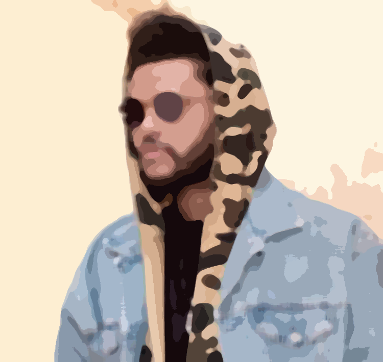

# PaintBrush

Applies a customizable, modern flat water color type effect on images (I'm not quite sure how to describe it just yet).

    
    

### Current Usage

Still a WIP but if you want to test it out on images, the quickest way is to use `main.py`, which takes command line arguments to test. Part of the project is built in cython, so you'll have to build the file for your machine first (maybe you don't need to, I'm stil figuring out the whole cython thing - also the build file is not included in git yet).

Build the cython file

`python3 setup.py build_ext --inplace` to build the cython code

Use the `main.py` file

The effect is created with a two part process
1. Group pixels similar in color together
    1. An `alpha` value (`float`) determines how much colors can vary to be considered "similar". `0` will not blend any colors together while something like `70` will blend together colors that are way different
2. Smooth out the jagged edges
    1. A `radius` value (`int`) determines how smoothed out the edges are

`python3 <input_img_path> <output_img_path> <alpha> <radius>`

Ex. `python3 assets/weeknd.jpg assets/weeknd_results.png 36 7`

(creates the resulting image above)

**NOTE:** As of right now, it only works on `jpg` images and will output `png` images.
